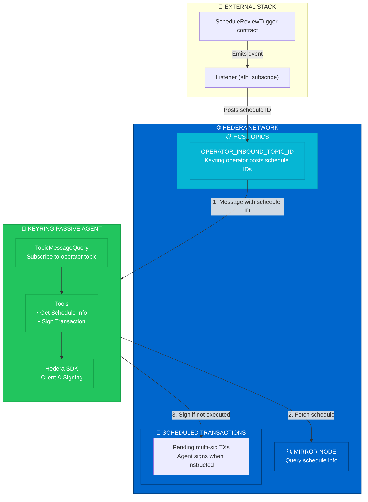

# 🦌⚡ KeyRing Passive Agent

Passive agent signers for the KeyRing protocol on Hedera network. Handles inactive signers and threshold rollover by signing schedules when instructed by the keyring operator.

## Overview

The KeyRing Passive Agent is a lightweight agent that subscribes to an **operator inbound topic** and signs scheduled transactions when the keyring operator posts a schedule ID. Unlike the active KeyRing Signer Agent (which polls and validates), the passive agent trusts operator-initiated messages and signs immediately—no rejection checks, no signature-count minimum.

Use cases:
- **Inactive signers:** Signers that don't run active monitoring but need to sign when notified
- **Threshold rollover:** Add new signers to a threshold list; passive agents sign when the operator triggers them
- **Cold signers:** Keys held in secure storage; agent runs only when operator sends a schedule ID

## Architecture



### Workflow

**1. Operator Triggers**
- Keyring operator (or upstream listener) posts a schedule ID to `OPERATOR_INBOUND_TOPIC_ID`
- Message format: `{"scheduleId": "0.0.1234"}` or plain `0.0.1234`

**2. Agent Receives**
- All agents subscribe to the same operator topic
- Each agent receives the message independently

**3. Sign Immediately**
- Agent fetches schedule info from mirror node
- If schedule exists and is not yet executed → sign
- No rejection checks, no minimum signature count (operator-initiated = trusted)

**4. Execution**
- When threshold is met, transaction executes on Hedera

## Features

- ✅ **Multi-agent:** Run multiple signers in one process; each has its own account
- ✅ **Operator-triggered:** Signs only when keyring operator posts a schedule ID
- ✅ **Immediate signing:** No polling, no validation delay—trust the operator
- ✅ **HCS subscription:** Real-time via Hedera `TopicMessageQuery.subscribe`
- ✅ **Utilities:** Create accounts, fund agents, send test schedules

## Quick Start

### Prerequisites

- Node.js 18+
- Hedera testnet account with HBAR (for funding agent accounts)
- Operator inbound topic (created by keyring operator stack)

### Installation

```bash
git clone https://github.com/0xPrimordia/keyring-passive-agent.git
cd keyring-passive-agent
npm install
```

### Configuration

Create a `.env` file (see `env.example`):

```bash
# Multi-agent: JSON array of signer accounts
AGENT_CONFIGS='[{"accountId":"0.0.1","privateKey":"302e...","operatorPublicKey":"302a..."},{"accountId":"0.0.2","privateKey":"302e...","operatorPublicKey":"302a..."}]'

# Shared config
HEDERA_NETWORK=testnet
OPERATOR_INBOUND_TOPIC_ID=0.0.xxxxx   # Topic where operator posts schedule IDs
```

### Running

```bash
npm run dev    # Development (tsx)
npm start      # Production (node dist/index.js)
```

## Project Structure

```
keyring-passive-agent/
├── src/
│   ├── agent/              # Agent implementation
│   │   ├── agent-config.ts
│   │   └── keyring-passive-agent.ts
│   ├── config/             # Config loading
│   │   └── load-config.ts
│   ├── tools/              # Agent tools
│   │   ├── get-schedule-info.ts
│   │   └── sign-transaction.ts
│   ├── utils/              # Utility scripts
│   │   ├── createAgentAccounts.ts
│   │   ├── fundAgentAccounts.ts
│   │   └── sendTestSchedule.ts
│   └── index.ts            # Entry point
├── hardhat/                # ScheduleReviewTrigger contract
│   ├── contracts/
│   └── scripts/
├── docs/
│   └── event-trigger-stack.md
├── package.json
└── README.md
```

## Available Scripts

```bash
npm run dev                  # Run agent (development)
npm start                    # Run agent (production)
npm run build                # Compile TypeScript
npm run create:accounts      # Create 2 agent accounts + topics (output AGENT_CONFIGS)
npm run fund:agents          # Fund agent accounts with HBAR
npm run send:test-schedule   # Send test schedule to ScheduleReviewTrigger (requires SCHEDULE_REVIEW_CONTRACT_ID)
npm run contracts:build      # Compile Solidity
npm run contracts:deploy     # Deploy ScheduleReviewTrigger
```

## Message Format

The operator topic expects messages containing a schedule ID:

- **JSON:** `{"scheduleId": "0.0.1234"}` or `{"schedule_id": "0.0.1234"}`
- **Plain:** `0.0.1234`

## Upstream Stack

This agent subscribes to an operator topic. The **listener stack** (separate repo) bridges contract events to that topic:

1. Contract emits `ReviewTriggered(scheduleId, topicId1, topicId2)`
2. Listener subscribes via `eth_subscribe` (Hedera RPC Relay)
3. Listener posts schedule ID to operator topic
4. Passive agent receives and signs

See [docs/event-trigger-stack.md](./docs/event-trigger-stack.md) for details.

## Technologies

- **Hedera SDK:** HCS subscription, schedule signing
- **TypeScript:** Type-safe development

## Security Considerations

- Private keys stored in environment variables only
- Never commit `.env` files
- Operator topic should be restricted (submit key = operator only)
- Agent trusts operator-initiated messages—ensure operator is secure

## License

ISC

## Author

Kevin Compton
