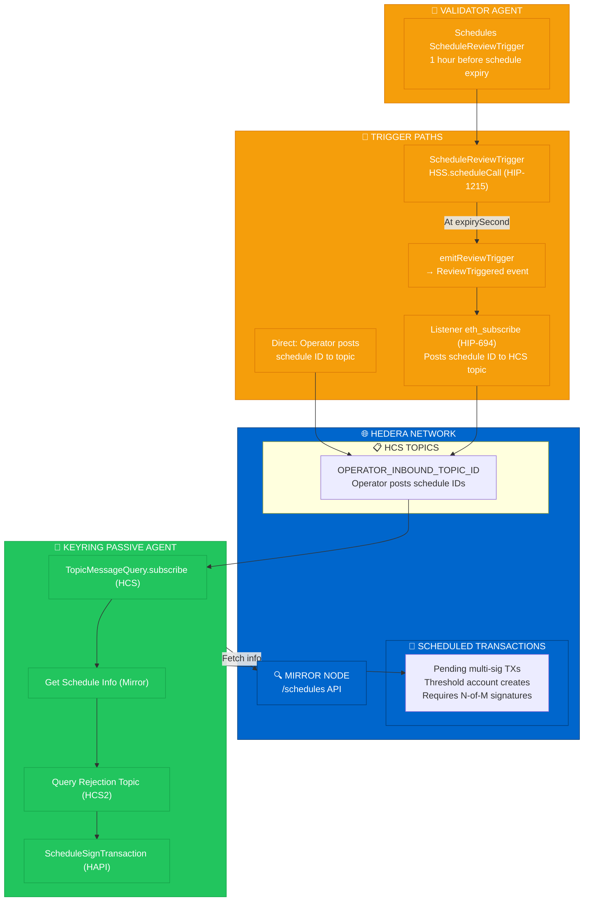

# 🦌⚡ KeyRing Passive Agent

Passive agent signers for the KeyRing protocol on Hedera network. Signs scheduled transactions when notified—no polling, no active monitoring.

## Related Repositories

| Repo | Purpose |
|------|---------|
| [0xPrimordia/KeyRing](https://github.com/0xPrimordia/KeyRing) | KeyRing Protocol – threshold list registry, governance platform |
| [0xPrimordia/lynx](https://github.com/0xPrimordia/lynx) | Lynx Token DAO – minting and governance dashboard |
| [kevincompton/keyring-signer-agent](https://github.com/kevincompton/keyring-signer-agent) | Validator agent – polls, validates, signs; schedules `ScheduleReviewTrigger` |
| [0xPrimordia/keyring-listener](https://github.com/0xPrimordia/keyring-listener) | Listens for `ReviewTriggered` events; posts schedule IDs to HCS topics |

## Overview

The KeyRing protocol uses **threshold multi-signature scheduled transactions** on Hedera. A scheduled transaction requires N-of-M signatures before it executes. The KeyRing Passive Agent is a signer that **does not poll** for pending schedules. Instead, it subscribes to an HCS topic and signs only when the keyring operator (or upstream trigger) posts a schedule ID.

### Main Flow: Scheduled Signing

1. **Scheduled transaction exists** on Hedera—created by the threshold account, requiring multiple signatures.
2. **Trigger** notifies the agent:
   - **Direct:** Operator posts schedule ID to the operator inbound topic.
   - **Automated (validator-initiated):** The [KeyRing Signer Agent](https://github.com/kevincompton/keyring-signer-agent) (validator) calls `ScheduleReviewTrigger.scheduleReviewTrigger(scheduleId, durationSeconds, topicId1, topicId2)` to schedule a future trigger—typically **one hour before the schedule expires**—so passive signers have time to sign. The contract uses the **Hedera Schedule Service (HSS)** via `scheduleCall` (HIP-1215) to schedule a one-time execution. At the scheduled time, the contract emits `ReviewTriggered(scheduleId, topicId1, topicId2)`. A listener subscribes via `eth_subscribe` (HIP-694), posts the schedule ID to the HCS topic.
3. **Agent receives** the schedule ID → fetches schedule info from mirror node → checks signing conditions → signs if eligible.
4. **Execution:** When the threshold is met, Hedera auto-executes the scheduled transaction.

### Signing Conditions

Before signing, the agent (or its tools) checks:

| Condition | Source | Description |
|-----------|--------|-------------|
| Not executed | Mirror Node `/schedules/{id}` | Schedule must not already be executed. |
| No valid rejections | `PROJECT_REJECTION_TOPIC` (HCS2) | Query rejection topic for messages mentioning this schedule; do not sign if other signers have rejected. |
| Minimum signatures | Mirror Node `signatures` | Schedule should have at least 2 signatures before this agent signs (per tool description). |

The agent uses `GetScheduleInfoTool` (mirror node) and `SignTransactionTool` (HAPI `ScheduleSign`). `QueryRejectionTopicTool` exists for rejection checks when `PROJECT_REJECTION_TOPIC` is configured.

### Why Passive?

Unlike the active KeyRing Signer Agent (which polls, validates, and may reject), the passive agent:

- **Subscribes** to an HCS topic and waits—no polling.
- **Trusts** operator/validator-initiated messages—signs when conditions are met.
- Suited for **inactive signers**, **threshold rollover**, and **cold signers** that only run when triggered.

## Hedera HIPs & Services

| HIP / Service | Purpose |
|---------------|---------|
| **[HIP-755](https://hips.hedera.com/hip/hip-755)** | Schedule Service System Contract (HSS at `0x16b`). Base HSS interface; `authorizeSchedule`, `signSchedule` for contracts. |
| **[HIP-1215](https://hips.hedera.com/hip/hip-1215)** | Generalized Scheduled Contract Calls. `scheduleCall` used by `ScheduleReviewTrigger` to schedule `emitReviewTrigger` at a future time (automated transaction protocol). |
| **[HIP-694](https://hips.hedera.com/hip/hip-694)** | Real-time events in JSON-RPC Relay. Listener uses `eth_subscribe` to receive `ReviewTriggered` contract events via WebSocket. |
| **HAPI Schedule Service** | Native `ScheduleSign` transaction. Agent submits `ScheduleSignTransaction` via Hedera SDK to add its signature to a scheduled transaction. |
| **Hedera Consensus Service (HCS)** | `TopicMessageQuery.subscribe`—agent subscribes to operator inbound topic for schedule IDs. |
| **Mirror Node REST API** | `/api/v1/schedules/{id}`—agent fetches schedule info (signatures, executed status). |
| **HCS2-indexed topics** | Rejection topic (`PROJECT_REJECTION_TOPIC`) for checking if a schedule has been rejected by other signers. |

## Architecture



### Workflow

**1. Scheduled Transaction Creation**

- Threshold account (or keyring operator) creates a scheduled transaction on Hedera.
- Transaction waits for N-of-M signatures and has an expiry window.

**2. Validator Schedules Trigger (Automated Path)**

- Validator agent computes `durationSeconds = (scheduleExpiry - now) - 3600` (1 hour before expiry).
- Calls `ScheduleReviewTrigger.scheduleReviewTrigger(scheduleId, durationSeconds, topicId1, topicId2)` with 1 HBAR.
- Contract uses HSS `scheduleCall` (HIP-1215) to schedule `emitReviewTrigger` at `now + durationSeconds`.
- At that time, network executes the scheduled call; contract emits `ReviewTriggered`.
- Listener (eth_subscribe) receives event → posts schedule ID to HCS topic.

**3. Trigger (Direct Path)**

- Operator posts `{"scheduleId": "0.0.1234"}` or `0.0.1234` to `OPERATOR_INBOUND_TOPIC_ID`.

**4. Agent Processing**

- Agent receives message → parses schedule ID.
- Fetches schedule info from mirror node (executed? signature count?).
- Optionally queries rejection topic for this schedule.
- If not executed and conditions met → signs with `ScheduleSignTransaction` (HAPI ScheduleSign).
- Skips if already executed or rejected.

**5. Execution**

- When threshold is met, Hedera executes the scheduled transaction on-chain.

## Features

- ✅ **Scheduled signing:** Signs Hedera scheduled transactions when notified.
- ✅ **Multi-agent:** Run multiple signers in one process; each has its own account.
- ✅ **Two trigger paths:** Direct operator topic or validator-initiated `ScheduleReviewTrigger` (HSS `scheduleCall`).
- ✅ **Signing conditions:** Executed check, optional rejection topic check, signature count.
- ✅ **HCS subscription:** Real-time via `TopicMessageQuery.subscribe`—no polling.
- ✅ **Utilities:** Create accounts, fund agents, send test schedules via contract.

## Quick Start

### Prerequisites

- Node.js 18+
- Hedera testnet account with HBAR (for funding agent accounts and contract)
- Operator inbound topic (or create via `create:accounts`)

### Installation

```bash
git clone https://github.com/0xPrimordia/keyring-passive-agent.git
cd keyring-passive-agent
npm install
```

### Configuration

Create a `.env` file (see `env.example`):

```bash
# Multi-agent: JSON array of signer accounts
AGENT_CONFIGS='[{"accountId":"0.0.1","privateKey":"302e...","operatorPublicKey":"302a..."},{"accountId":"0.0.2","privateKey":"302e...","operatorPublicKey":"302a..."}]'

# Shared config
HEDERA_NETWORK=testnet
OPERATOR_INBOUND_TOPIC_ID=0.0.xxxxx   # Topic where operator posts schedule IDs
PROJECT_REJECTION_TOPIC=0.0.xxxxx    # Optional: for rejection checks
```

Single-agent fallback: set `HEDERA_ACCOUNT_ID`, `HEDERA_PRIVATE_KEY`, `OPERATOR_PUBLIC_KEY`.

### Running

```bash
npm run dev    # Development (tsx)
npm start      # Production (node dist/index.js)
```

## Project Structure

```
keyring-passive-agent/
├── src/
│   ├── agent/              # Agent implementation
│   │   ├── agent-config.ts
│   │   └── keyring-passive-agent.ts
│   ├── config/             # Config loading
│   │   └── load-config.ts
│   ├── tools/              # Agent tools
│   │   ├── get-schedule-info.ts    # Mirror node schedule query
│   │   ├── sign-transaction.ts     # HAPI ScheduleSign
│   │   └── query-rejection-topic.ts # HCS2 rejection topic
│   ├── utils/              # Utility scripts
│   │   ├── createAgentAccounts.ts
│   │   ├── fundAgentAccounts.ts
│   │   └── sendTestSchedule.ts
│   └── index.ts            # Entry point
├── hardhat/                # ScheduleReviewTrigger (HSS scheduleCall)
│   ├── contracts/
│   └── scripts/
├── docs/
│   └── event-trigger-stack.md
├── package.json
└── README.md
```

## Available Scripts

```bash
npm run dev                  # Run agent (development)
npm start                    # Run agent (production)
npm run build                # Compile TypeScript
npm run create:accounts      # Create 2 agent accounts + topics (output AGENT_CONFIGS)
npm run fund:agents          # Fund agent accounts with HBAR
npm run send:test-schedule   # Call ScheduleReviewTrigger (requires SCHEDULE_REVIEW_CONTRACT_ID, SCHEDULE_ID)
npm run contracts:build      # Compile Solidity
npm run contracts:deploy     # Deploy ScheduleReviewTrigger (deploy with 1 HBAR)
```

## Message Format

The operator topic expects messages containing a schedule ID:

- **JSON:** `{"scheduleId": "0.0.1234"}` or `{"schedule_id": "0.0.1234"}`
- **Plain:** `0.0.1234`

## Mainnet Deployment (for Judges)

| Resource | ID | HashScan |
|----------|-----|----------|
| ScheduleReviewTrigger contract | `0xe96681cf23bb16f96DD3093FB989A354Ab731947` | [View →](https://hashscan.io/mainnet/contract/0xe96681cf23bb16f96DD3093FB989A354Ab731947) |
| Threshold account | `0.0.10379056` | [View →](https://hashscan.io/mainnet/account/0.0.10379056) |
| Operator inbound topic | `0.0.10379313` | [View →](https://hashscan.io/mainnet/topic/0.0.10379313) |
| Validator inbound topic | `0.0.10379414` | [View →](https://hashscan.io/mainnet/topic/0.0.10379414) |
| Rejection topic | `0.0.10379406` | [View →](https://hashscan.io/mainnet/topic/0.0.10379406) |
| Agent 1 inbound topic | `0.0.10379026` | [View →](https://hashscan.io/mainnet/topic/0.0.10379026) |
| Agent 2 inbound topic | `0.0.10379029` | [View →](https://hashscan.io/mainnet/topic/0.0.10379029) |

## ScheduleReviewTrigger Contract

**Mainnet:** [`0xe96681cf23bb16f96DD3093FB989A354Ab731947`](https://hashscan.io/mainnet/contract/0xe96681cf23bb16f96DD3093FB989A354Ab731947)

The contract enables **time-delayed** triggers via the Hedera Schedule Service (HIP-1215):

- **`scheduleReviewTrigger(scheduleId, durationSeconds, topicId1, topicId2)`** — payable, requires 1 HBAR.
- Uses HSS `scheduleCall` at `0x16b` to schedule a one-time call to `emitReviewTrigger` at `now + durationSeconds` (max 62 days).
- When the scheduled time arrives, the network executes the call; contract emits `ReviewTriggered(scheduleId, topicId1, topicId2)`.
- Listener subscribes via `eth_subscribe` (HIP-694) and posts the schedule ID to the HCS topic.

See [docs/event-trigger-stack.md](./docs/event-trigger-stack.md) for the full listener stack.

## Technologies

- **Hedera SDK:** HCS `TopicMessageQuery.subscribe`, HAPI `ScheduleSignTransaction`, mirror node queries
- **TypeScript:** Type-safe development

## Security Considerations

- Private keys stored in environment variables only
- Never commit `.env` files
- Operator topic should be restricted (submit key = operator only)
- Agent trusts operator/validator-initiated messages—ensure operator is secure

## License

ISC

## Author

Kevin Compton
